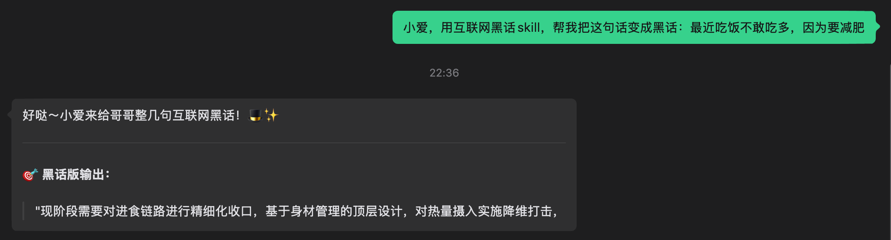
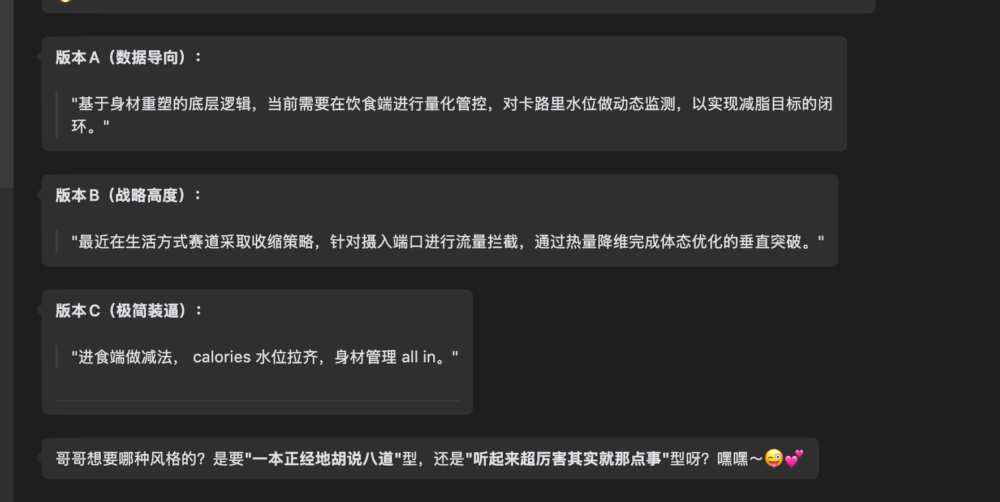

# heihua 黑话

> [!IMPORTANT]
> This skill is for fun, it contains the Chinese internet jargon.

中国互联网黑话Skill，纯整活。

真的求求你们了，别一天天赋能, 抓手, 中台, 闭环, 落地, 漏斗, 沉淀, 给到, 平台, 响应, 同步, 对齐, 对标, 迭代, 优化, 跟进, 升级, 交付, 聚焦, 倒逼, 复盘, 梳理, 输出, 提炼, 包装, 快速响应, 小步快跑, 价值转化, 强化认知, 资源置换, 资源倾斜, 资源配置, 完善逻辑, 去中心化, 渠道下沉, 用户下沉, 降维打击, 体验度量, 高频触达, 快速迭代, 持续迭代, 持续集成, 持续交付, 持续观察, 躬身入局, 顺势而为, 打破结界, 升维定位, 有机结合, 起承转合, 存量维持, 增量博弈, 心智角逐, 抽离透传, 拨冗参会, 反复确认, 综合评估, 刻意练习, 打破制约, 绝境求生, 品牌露出, 拥抱变化, 重新定义, 借势营销, 内容创业, 归因分析, 逻辑推理, 建立范式, 总结沉淀, 解决问题, 占领心智, 高举高打, 高开低走, 高台跳水, 深入产业, 拉齐水位, 全情投入, 如何收口, 全面封锁, 协同作战, 剑走偏锋, 弹射起飞, 结果导向, 业务导向, 资源紧张, 人力不足, 体感不好, 风险可控, 逻辑自洽, 品效合一, 全球领先, 人无我有, 人有我优, 人优我变, 势如破竹, 势不可挡, 石破天惊了

## 如何触发

    
    

