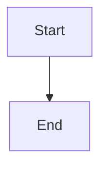
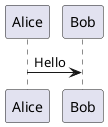

# Slidev Syntax Reference

## Slide structure

```markdown
---
theme: default
title: My Presentation
---

# Slide 1

Content here

---

layout: center
class: text-center

# Centered Slide

Text on a centered layout.
```

Global frontmatter goes in the first `---` block. Per-slide frontmatter goes between a `---` separator and the slide content.

## Global frontmatter

| Key | Purpose | Example |
|---|---|---|
| `theme` | Theme name | `default`, `seriph` |
| `title` | Presentation title | `My Talk` |
| `colorSchema` | Color mode | `light`, `dark`, `auto` |
| `fonts` | Font configuration | `fonts: { sans: Inter }` |
| `highlighter` | Code highlighter | `shiki`, `prism` |
| `drawings` | Drawing tool | `enabled: true` |
| `remoteAssets` | Load remote assets | `true`, `false` |

## Per-slide frontmatter

| Key | Purpose | Example |
|---|---|---|
| `layout` | Slide layout | `cover`, `center`, `default`, `two-cols`, `image-right` |
| `class` | CSS classes | `text-center` |
| `transition` | Slide transition | `slide-left`, `slide-up`, `fade`, `fade-out` |
| `background` | Background image/color | `https://example.com/bg.png` |
| `clicks` | Total click count | `3` |
| `level` | Heading level for TOC | `1`, `2` |

## Code blocks

````markdown
```ts
console.log("Hello Slidev");
```

```ts {1|2|3}
// Line-by-line click highlighting
const a = 1;
const b = 2;
const c = 3;
```

```ts {2,3|5|all}
// Multi-line groups
const a = 1;
const b = 2;  // highlighted with line 3
const c = 3;  // highlighted with line 2
```

```ts {maxHeight:'100px'}
// Scrollable code block
```
````

Add `{monaco}` after the language tag for a live Monaco editor (`{monaco}` requires `@slidev/monaco`).

## Diagrams

Mermaid and PlantUML inline in fenced code blocks:

````markdown



````

## Math

KaTeX renders LaTeX:

```markdown
Inline: $E = mc^2$

Block:
$$
\int_{a}^{b} f(x) \, dx
$$
```

## Layouts

Built-in layouts: `cover`, `center`, `default`, `two-cols`, `image-right`, `image-left`, `iframe`, `iframe-right`, `none`, `quote`, `statement`, `fact`, `intro`.

Custom layouts in `layouts/` directory, referenced by filename.

## Animations

### Click animations

```markdown
<v-click>Appears on first click</v-click>
<div v-click>Also appears on click</div>
<div v-after>Appears with the previous element</div>

<v-clicks>
- Item 1
- Item 2
- Item 3
</v-clicks>

<v-clicks depth="2">
- Parent item
  - Child A
  - Child B
</v-clicks>
```

`v-click` accepts an index: `<v-click :at="2">` appears on the second click.

### Motion effects

```markdown
<div v-motion
  :initial="{ opacity: 0, y: 100 }"
  :enter="{ opacity: 1, y: 0 }"
  :duration="500">
  Fade and slide up
</div>
```

### Transitions

Set on per-slide frontmatter:

```yaml
transition: slide-left
```

Built-in transitions: `fade`, `fade-out`, `slide-left`, `slide-right`, `slide-up`, `slide-down`, `view-transition`.

### Presenter notes

```markdown
<!--
These notes are visible only in presenter mode.
-->
```

Or as a frontmatter block after the slide content.

## Styling

### Global styles

Add a `style.css` or `styles/index.css` file and import it in the global frontmatter:

```yaml
---
css: styles/index.css
---
```

### Scoped styles

```markdown
<style>
h1 { color: #3b82f6; }
</style>
```

### UnoCSS

Slidev uses UnoCSS. Utility classes work directly:

```markdown
<div class="text-blue-500 font-bold">
  Styled with UnoCSS
</div>
```

Configure UnoCSS in `uno.config.ts`.

## CLI commands

| Command | Purpose |
|---|---|
| `slidev` | Start dev server |
| `slidev [file.md]` | Start dev server with specific entry |
| `slidev --open` | Start and open browser |
| `slidev --port 3030` | Start on custom port |
| `slidev export` | Export to PDF |
| `slidev export --format pptx` | Export to PPTX |
| `slidev export --format png` | Export as PNG images |
| `slidev export --with-clicks` | Render click steps as separate pages |
| `slidev export --dark` | Export in dark mode |
| `slidev export --range 1,3-5` | Export specific slides |
| `slidev export --wait 1000` | Wait ms between slides (png only) |
| `slidev export --timeout 120000` | Export timeout in ms |
| `slidev build` | Build static SPA to `dist/` |
| `slidev build --base /subpath/` | Build with base path |
| `slidev build --out custom-dir` | Custom output directory |
| `slidev build --download` | Download remote assets for offline use |
| `slidev format` | Format `slides.md` |
